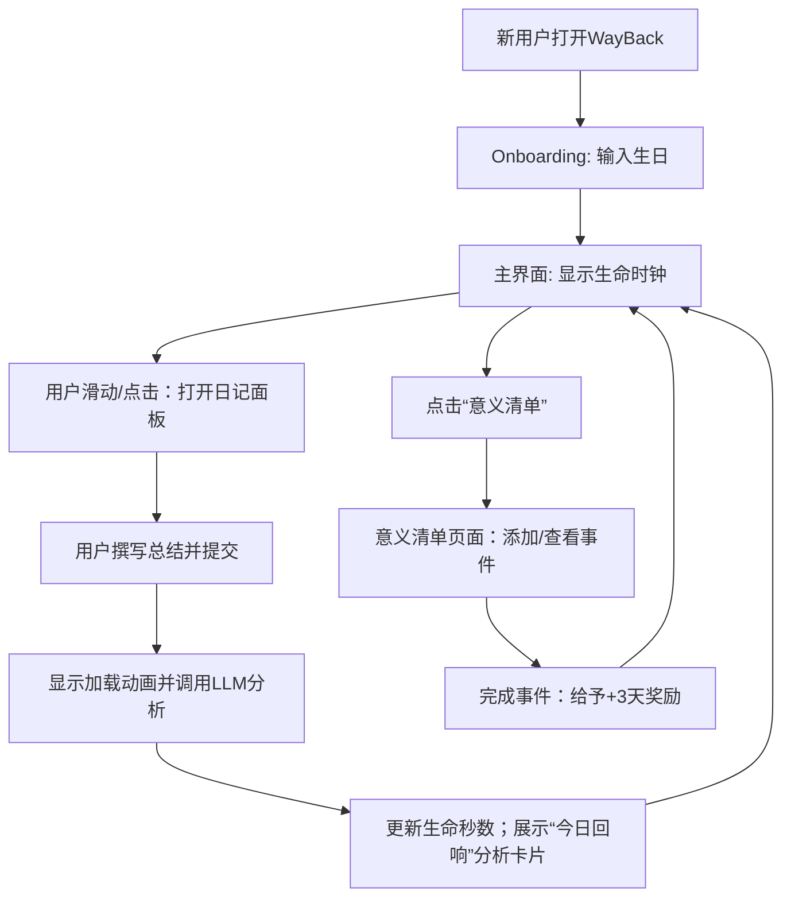

# **WayBack（归途）项目实施方案**

**执行摘要：** 现代都市年轻人（约25–45岁）面临高度的孤独感和生存焦虑，对生命意义和个人成长有强烈需求。WayBack 通过“生命倒计时”与 AI 分析用户日常总结，将死亡焦虑转化为积极激励，引导用户珍惜时间、关注当下。该方案从用户心理痛点出发，设计病毒式传播的功能和社交机制，同时确保数据安全与高可用性，覆盖 Web 端与未来 Android 应用。

## **1. 目标用户与心理动因**

- **目标人群画像：** 城市中25–45岁独居或单身青年，多为职场人士，对个人成长、时间管理、生命意义有思考，易受拖延与焦虑困扰。平时社交主要在线上，独居带来“无人知晓安全状况” 的隐秘担忧。
- **心理诉求与痛点：** 感到孤独、焦虑，害怕“孤独死”消失无闻【8†L32-L35】；需要外部激励克服拖延；渴望对生命意义和自我成长进行量化反思。基于社会认知：**死亡焦虑**与**社交孤立**驱动了该群体对此类产品的需求【8†L32-L35】【8†L37-L45】。
- **社交心理驱动：** 高强度情绪驱动内容传播（84%的人分享内容是为表达关心【30†L81-L89】），**社交证明**（点赞、分享、关注等）形成“从众效应”助推裂变【30†L111-L119】【35†L148-L157】。我们设计**情感化功能**（黑色幽默倒计时、AI 共情反馈）+**社交分享机制**（成就分享、打卡榜），利用情绪共鸣与社交证明实现病毒式增长。

## **2. 核心价值主张与定位**

WayBack 定位为“**生命质量激励与自我成长工具**”，通过**实时倒计时**提醒生命宝贵，结合**AI分析**提供每日情感反馈。核心价值：  
- **时间提醒**：直观化剩余生命时间，增加时间紧迫感。  
- **情感支持**：AI 角色式分析“生命导师”反馈，让用户感到被理解和鼓励。  
- **自我量化**：记录目标与成长，通过奖励机制强化积极行为。  
- **安全保障**：与亲朋联系的“安心”功能保证独居安全（借鉴“死了么”警示模式）。  

## **3. 功能列表与版本规划**

- **MVP（v1.0）核心功能：**  
  - **用户初始化**：首次注册时输入生日，计算并展示初始生命剩余总秒数。  
    - *接受准则*：生日输入完成后，后端正确计算 `currentLifeSeconds = (78岁 - 出生年月)` 秒数并存储。  
  - **生命时钟**：主界面显示“XX年XX天 XX:XX:XX”倒计时，每秒精准减1。  
    - *接受准则*：倒计时连贯流畅，无明显卡顿；时钟格式正确。  
  - **每日总结与AI分析**：  
    - 用户每天填写一次日记总结（≥50字），提交后界面显示加载动画。  
    - 后端将文本送入 LLM（如 GPT-4/Gemini），要求返回 `{ timeDeltaSeconds, analysis, sentiment }` JSON。  
    - 系统更新生命时钟：积极日记（timeDeltaSeconds>0）增加秒数，消极（<0）扣减秒数；展示 AI 分析文字反馈。  
    - *接受准则*：每用户每天仅可提交一次，LLM 返回后能正确更新数据库中的 `currentLifeSeconds`，前端展示分析理由卡片。  
  - **意义清单**：用户可添加“此生必做”列表，每完成一项标记“已完成”并获得固定奖励（+259200秒＝3天）。  
    - *接受准则*：完成事件后，`currentLifeSeconds` 增加3天，事件状态变为 completed，前端显示绿色勾选反馈。  

- **版本迭代功能（v1.1–v1.3）：**  

  | 版本  | 新功能/优化                                                     | 接受准则                                         |
  | :---: | -------------------------------------------------------------- | ------------------------------------------------ |
  | v1.1  | *社交分享*：允许用户将生命时钟截图/分析结果分享到微信/微博等，增加标签和表情包选项。 | 分享内容自动生成图片预览；点击可跳转回App主页；分享数据符合用户隐私设定。 |
  | v1.2  | *AI导师升级*：LLM 支持中英文切换，增加每日小贴士（情绪调节或健康建议）。     | 日记分析输出多样化评论与建议；触发健康提示时不违反医疗建议规范【15†】。 |
  | v1.3  | *社区与活动*：上线用户挑战赛（打卡圈子）、日记交流社区，提高互助感；新增成就徽章系统。 | 社区模块可发布帖子、点赞评论；活动签到功能正常；用户成就系统透明、图标清晰。 |

## **4. 用户流程与交互设计**

- **用户流程：** 新用户打开网页/PWA → 注册并输入生日 → 进入主界面生命倒计时 → 每日上滑或点击打开总结面板 → 输入当日总结 → 提交后加载动画 → 展示分析卡片并更新倒计时 → 用户可点击“意义清单”进入目标列表 → 添加/完成事件获得奖励 → 返回主界面。  



- **交互动画：** ① **Onboarding 粒子动画**：新用户注册时，屏幕四周粒子元素收拢形成倒计时数字，营造神秘仪式感。② **倒计时翻页动画**：生命时钟每秒更新，年、月、日数字逐位翻页滚动。③ **提交与分析**：点击“提交”，输入框按钮变为加载状态，屏幕中央出现由光点组成的“思考中”动画。④ **反馈卡片**：分析完毕后，“今日回响”卡片从下方平滑弹出，展示分析文字，5秒后自动收回。  

- **可访问性**：确保大字体对比度（建议深空黑背景与白色文本对比度≥4.5:1【34†】），提供大字体选项，按钮易点（建议不低于44x44px）。简洁布局，避免过度装饰，关键操作一目了然。

## **5. UI/UX 设计规范**

- **视觉风格**：深邃宁静、科技感强。主色调采用**深空黑（#0C0A14）**背景，数字与文本用**星光白（#EAEAEA）**，点缀色使用**暗金（#D4AF37）**营造质感，积极反馈按钮或图标用**冰川蓝（#7DF9FF）**。整体风格简约留白，以弱化焦虑感。【13†L55-L63】描述的“激励而非恐惧”定位（“Time is a countdown… not fear【13†L65-L68】”）可作为设计灵感。
- **字体排版**：倒计时数字使用系统无衬线（如 Inter）浅粗体，强调清晰；口号或引导语可用衬线字体（如宋体）增添诗意。  
- **布局**：核心元素垂直居中，响应式适配，确保手机版和PC版一致体验。大量留白和渐变背景，传达宁静感。  
- **动效**：采用 CSS3/Canvas 渐变粒子动画、翻页动画、渐变遮罩等增强沉浸。注意动画流畅度，避免卡顿影响用户操作。

## **6. 技术架构（Mermaid）**

前端采用现代 Web 框架（React/Vue/PWA）＋微信/Android，后端使用云服务（Node.js）与 LLM。系统整体架构如下图所示：  

```mermaid
graph LR
    subgraph 前端
        A[浏览器/PWA/Android App]
        A -->|REST API 请求| B[API 网关 / Node.js]
    end
    subgraph 后端
        B --> C[云函数 Business Logic]
        C --> D[LLM 服务接口 (Gemini/GPT-4)]
        C --> E[云数据库 (Firestore)]
        C --> F[邮件/SMS 服务 (SMTP/Twilio)]
        D --> C
        E --> C
    end
```

- **前端**：使用 React 或 Vue.js 开发响应式 WebApp，封装 API 请求模块；借助 PWA 技术实现离线缓存和通知。Android 原生版可采用 React Native/Flutter（见后文）。  
- **后端**：Node.js + Express 或 Firebase Cloud Functions，负责业务逻辑。**API 设计**：`POST /users`（创建用户），`POST /users/{id}/daily_log`（提交日记分析），`GET/PUT /users/{id}/meaning_list`（清单管理）等，详见下表。  
- **AI 层**：后端构造 Prompt 调用 LLM（如 Google Gemini/GPT-4），限制输出为结构化 JSON（见下节）。  
- **数据库**：NoSQL 云数据库（如 Firestore），存储用户资料、生命时间、日记记录、清单事件等。  
- **邮件/短信**：内置 Webhook 调用第三方服务（Postmark/SendGrid/Twilio）实现紧急提醒（后期可选）。  
- **认证**：前端通过 OAuth2.0（微信授权登录或邮箱验证码）进行用户认证，后端使用 JWT 保护 API。  

## **7. 数据模型与API 合约**

- **数据表/模型示例**：  

  | 表/集合名    | 字段示例                              | 说明                         |
  | :---------: | ------------------------------------- | -------------------------- |
  | users       | `id, birthDate, lifeTotalSec, currentLifeSec` | 用户基本信息与生命总秒数   |
  | daily_logs  | `id, userId, date, text, timeDeltaSec, sentiment, analysis` | 每日总结及AI分析结果 |
  | meaning_list| `id, userId, title, completed, completedAt`   | 用户“意义清单”条目       |
  | transactions| `id, userId, type, amountSec, timestamp, reason` | 时间增减流水记录（选填）  |

- **API 端点示例**：  

  1. **POST /users**：创建新用户  
     - 请求：`{ "birthDate": "YYYY-MM-DD" }`  
     - 响应：`{ "userId": "...", "initialLifeSec": 2506752000, "currentLifeSec": 2506752000 }`  
  2. **POST /users/{userId}/daily_log**：提交当天总结  
     - 请求：`{ "text": "今日日记内容..." }`  
     - 响应：`{ "timeDeltaSec": 3600, "newLifeSec": 2506755600, "analysis": "你的身体状态良好..." }`  
  3. **GET /users/{userId}/meaning_list**：获取清单  
     - 响应：`[ { "id": "...", "title": "环游世界", "completed": false }, ... ]`  
  4. **POST /users/{userId}/meaning_list**：添加清单项  
     - 请求：`{ "title": "参加马拉松" }`  
  5. **PUT /users/{userId}/meaning_list/{itemId}**：标记完成  
     - 响应：`{ "addedSec": 259200, "newLifeSec": 2507014800 }`  

  **数据验证**：所有请求需校验用户身份与参数完整性；`timeDeltaSec` 必须为整数且范围[-14400,14400]（±4小时）以内，否则后端忽略并返回`timeDeltaSec=0`。在调用 LLM 时严格解析 JSON 响应，如解析失败则默认返回 `{timeDeltaSec:0, sentiment:"neutral", analysis:"未能理解您的日记，请再试。"} `。

## **8. LLM 提示设计与安全规则**

- **Prompt 示例**：  
  ```
  角色：生命导师。根据以下用户日记，评估其身体、心智、情感状态，并以简洁JSON形式回答：{"timeDeltaSeconds":<整数>,"sentiment":"<positive|negative|neutral>","analysis":"<中文分析>"}。timeDeltaSeconds 范围[-14400,14400]。
  用户日记："${summaryText}"
  ```  
- **安全与验证**：LLM 返回需为**严格的JSON**，后端使用 JSON 解析（或正则）检查输出格式。如不符合（缺字段、非法数字等），则采用**安全回退**：`timeDeltaSeconds=0，sentiment:"neutral"，analysis:"抱歉，暂时无法分析您的记录。"`. 通过此方式防止敏感或格式错误输出。  
- **避免风险**：提示中限定分析范围和语气，中英文环境下都用尊重语气；不询问敏感信息；避免触发医疗建议等法律风险。  

## **9. 安全、隐私与合规**

- **数据最小化**：按照 FTC 建议，仅收集必需数据（用户出生日期、日记文本、联系方式），其他信息不留存【17†L400-L408】。采用加密存储生命数据，传输使用 HTTPS。  
- **权限限制**：应用请求最少系统权限，不访问用户通讯录等额外资源【17†L441-L449】。默认不分享用户数据给第三方。提供隐私政策，说明数据用途。  
- **身份认证**：使用 OAuth2 或安全的登录机制，支持强密码或多因素认证【17†L471-L479】。令牌存储加密，防止泄露。  
- **法律合规**：遵守所在国家数据保护法规（如欧盟GDPR、中国网络安全法等），对用户日记内容进行匿名处理。应用于心理分析领域时，提供免责申明，标注“仅为参考，不替代专业诊断”。  

## **10. 性能与可靠性规划**

- **性能目标**：前端时钟每秒更新不掉帧；AI 分析响应≤1.5秒（可使用异步提示或延时动画缓冲）；每日重置机制凌晨自动生效。  
- **架构扩展**：后端使用无状态云函数，水平扩展处理用户请求高峰。数据库选择支持并发的云服务（Firestore/RealtimeDB），使用索引加速查询。  
- **监控报警**：部署后端监控（如Google Cloud Monitoring），跟踪API延迟、错误率。配置报警：若错误率或延迟超阈值自动通知运维。  
- **可用性**：前端采用PWA，支持离线缓存（至少能查看倒计时历史）。数据异步同步，确保即使网络波动也不丢失用户输入。备份数据库，保障数据不丢失。  

## **11. 测试计划**

- **单元测试**：  
  - `calculateInitialSeconds(birthDate)`：不同出生日期验证秒数计算正确。  
  - 时间格式化函数测试：输入秒数返回正确的“年-天-时-分-秒”格式。  

- **集成测试**：  
  - **日记分析流程**：输入正向日记（如锻炼、学习）预期后台返回 `timeDeltaSeconds>0`，数据库`currentLifeSec`增加；输入负向日记（如熬夜、郁闷）预期返回`timeDeltaSeconds<0`。  
  - **意义清单流程**：标记事件完成后，检查事件状态和时间奖励是否生效。  
  - **API全流程**：模拟用户注册、登录、提交日记、查看清单整个过程，确保无授权或逻辑错误。  

- **系统测试**：  
  - **压力测试**：模拟百万用户并发访问，验证系统在高负载下的响应和稳定性。  
  - **安全测试**：进行渗透测试，验证XSS、SQL注入、身份窃取等漏洞。  

- **用户验收测试（UAT）示例题**：  
  - 登陆流程是否直观清晰？  
  - 倒计时界面设计是否符合“深邃宁静”预期？  
  - 提交日记后的动画反馈是否顺畅？  
  - LLM反馈的内容是否让用户感觉“贴切”且易懂？  
  - 应用在付费/订阅转换环节是否有痛点？  

## **12. 部署与CI/CD**

- **代码管理**：使用 Gitflow 工作流。项目分前后端代码库。  
- **构建管道**：前端采用 Webpack 打包，后端采用 Cloud Functions 部署脚本。建立 CI 流程（如 GitHub Actions）：  
  1. 代码提交触发 lint 与单元测试。  
  2. 测试通过后自动部署到测试环境（Staging）。  
  3. 手动或自动化检查后，触发生产环境部署。  
- **持续集成**：集成 E2E 自动化测试（Cypress或 Selenium）保障版本质量。自动化工具检查安全漏洞（如 Snyk）。

## **13. Android 兼容策略**

- **PWA优先**：初期Web版本采用PWA，可通过 Chrome/Edge“一键安装”在Android上使用。离线功能与通知确保基础可用性。  
- **跨平台开发**：未来计划使用 **React Native** 或 **Flutter** 重用已有逻辑。建议先构建 Web API 和 UI 组件库，再移植到移动端框架，以节省资源。  
- **渐进开发**：先发布 Web 产品、收集用户反馈；Android App1.0 可以基于 Webview 或容器技术快速上线。后续根据用户需求开发原生功能（如离线通知、背景定位等）。  

## **14. 上线与增长策略**

- **病毒钩子**：利用“**脑洞大开命名**”吸睛（参考“死了么”），同时在 App 内置分享功能（时钟截图、成就徽章）。设计*邀好友功能*：用户可邀请好友关注自己的生命倒计时，相互监督与打气。  
- **社交媒体传播**：制造情感化营销素材（用户案例故事、示例分析），结合微博、知乎、抖音等平台进行科普与讨论，引发用户共鸣（“你今天爱惜时间了吗？”）。  
- **意见领袖合作**：与心理健康博主、知名自媒体合作，分享 WayBack 使用体验。利用用户UGC（朋友圈晒卡截图）形成口碑传播。  
- **定价与订阅**：基础功能免费（仅显示倒计时与少量分析），高级功能（无限日记分析、历史数据报告、专家直播等）设订阅收费。考虑与心理咨询机构或健身品牌合作，提供增值服务。  
- **增长策略**：根据社交证明理论，展示已有用户数、付费人数或成功案例（匿名）等。参考《Sprout Social》所述，用户更信任他人推荐【35†L170-L179】；可以在APP商店截图中标注“数万青年用户信赖”。

## **15. 路线图与资源估算（6个月）**

| 时间      | 里程碑                              | 人力投入（FTE） | 预算估计（人民币）        |
| :-------- | :-------------------------------- | :------------: | :------------------: |
| **第1** | 需求分析与设计：完成PRD、原型图、UI设计稿。 | 产品1、设计2、后端1 | 5–10万            |
| **第2** | 开发MVP：实现用户注册、倒计时、日记提交接口；搭建后端框架。 | 前端2、后端2  | 10–15万           |
| **第3** | 完善AI分析：集成LLM接口，调整Prompt，进行内部测试；实现意义清单功能。 | 前端1、后端2、AI专家1 | 15–20万   |
| **第4** | UI优化与动画：完善动效、适配移动端；安全加固与隐私文档。 | 前端1、后端1  | 10–15万           |
| **第5** | 测试与调优：完成功能测试、修复BUG；部署测试环境进行用户反馈。 | 测试2、前端1、后端1 | 10万             |
| **第6** | 上线发布：准备市场推广素材，发布Web与安卓版；监控并快速迭代修复。 | 运维1、产品1  | 20万+（市场推广） |

**假设与说明：** 以上仅为示例估算。实际团队可能包括前端、后端、AI、测试、运维、市场等角色。预算主要为开发与运营成本，不含硬件采购。第6月之后产品持续迭代、扩展功能与市场推广。

**参考：** 以上设计方案综合参考了类似产品的实践与研究成果。例如已有倒计时应用 **Life Countdown** 强调”时间倒计时激励而非恐惧”，鼓励用户”珍惜每一刻”【13†L55-L63】；`死了么` 爆火案例说明了数字化生存焦虑和单身青年情感需求【8†L32-L35】【8†L37-L45】；FTC 发布的移动健康应用安全指南强调”最小化数据收集、精心设计权限和身份验证”【17†L400-L408】；社交传播心理学研究则表明”强烈情绪和社交证明可显著提高内容分享率”【30†L81-L89】【30†L111-L119】。

## **16. 当前实现状态与改进建议**

### ✅ 已完成 (MVP + 迭代)
- 用户初始化：生日输入 + 生命秒数计算
- 生命时钟：实时倒计时显示 + 翻页动画
- 每日总结：日记输入 + AI 分析（模拟）
- 意义清单：添加/完成事件 + 奖励
- UI/UX：深空黑主题 + 粒子动画 + 星空背景
- PWA 支持：manifest.json + service worker + iOS 支持
- 数据导出：设置页面支持 JSON 导出
- 单元测试：Vitest 单元测试通过
- 构建通过：npm run build 成功

### 🔄 改进建议 (待迭代)
1. **真实 LLM 集成**：当前是模拟响应，需集成 Gemini/GPT-4 API
2. **隐私合规**：添加隐私政策页面

### 📋 后续版本规划
- v1.1: 社交分享功能
- v1.2: AI 导师升级（中英文切换）
- v1.3: 社区与成就系统

**总结：** WayBack 致力于在满足独居青年情感刚需的同时，成为他们管理时间、提升生活质量的伙伴。通过合理的产品设计与技术实现，我们将打造一个情感共鸣强、操作便捷、可持续的爆款应用，帮助用户在焦虑中找到前行的力量。  


